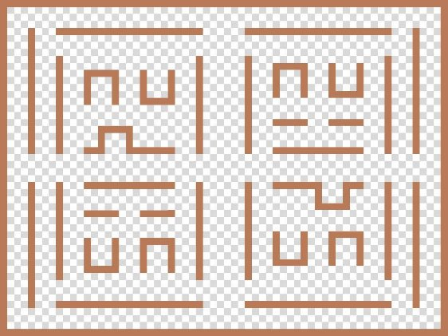

**mincraft** 苦力怕追殺史帝夫之鬼抓人
---

**功能敘述** 

- 遊戲使用 VGA 顯示到螢幕上。 
- 最開始使用 SW[17]當 reset。 
- 設定遊戲階段(畫面顯示全青色)，可以調整遊戲時間(以 SW[1]、SW[0]進行調整)，可 以調整 4個檔位，每個檔位加 15秒，最小 15最大 60秒(此時七段顯示器會顯示調整時 間。 
- 調整完使用最左下角的 0x16開始遊戲，進入遊戲後會看到遊戲主畫面，可以使用按鈕 來操作 steve，從左到右(button)分別是上下左右。 
- 苦力怕由 IR的 2、4、6、8分別是上左右下。 
- Steve的目標是不被苦力怕抓到直到遊戲結束獲勝，苦力怕則是在時間內抓到 steve。 
- 若 steve獲勝畫面會顯示綠色，苦力怕獲勝會顯示紅色。 
- 當有一方獲勝，LED 會閃爍，此時可以使用 ir 的 0x14 回到設定階段(操作流程如上)。 

  

**遊戲圖片** 

▲地圖 

 

▲苦力怕&nbsp;&nbsp;&nbsp;&nbsp;&nbsp;&nbsp;&nbsp;&nbsp;&nbsp;&nbsp;&nbsp;&nbsp; ▲史帝夫

▲遊戲畫面

**結論**

- 在這個專題中，我們學到很多分工合作的技巧，以及很多 verilog 撰寫的技巧，其中在 我們為了實現地圖與腳色顯示到螢幕上，我們利用 y 跟 x 座標讀取資料進來並判斷是 否顯示當前像素。 
- 在移動腳色方面，我們使用個別的 x 跟 y 來代表兩個人物，並且改動 x 跟 y 來移動人 物座標(VGA 是根據 x、y 來畫人物的)。 

參考資料 

- 苦力怕: [https://people2.pixnet.net/blog/post/40218122 ](https://people2.pixnet.net/blog/post/40218122)
- 史帝夫: [https://www.pinterest.com/pin/375487687673255002 ](https://www.pinterest.com/pin/375487687673255002)
- MC 標題: [https://icon-icons.com/icon/minecraft-logo/168099 ](https://icon-icons.com/icon/minecraft-logo/168099)
  
